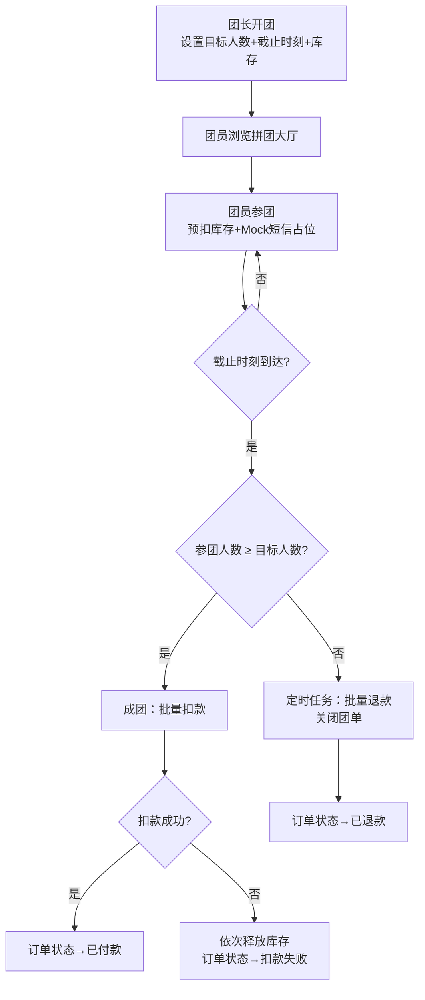
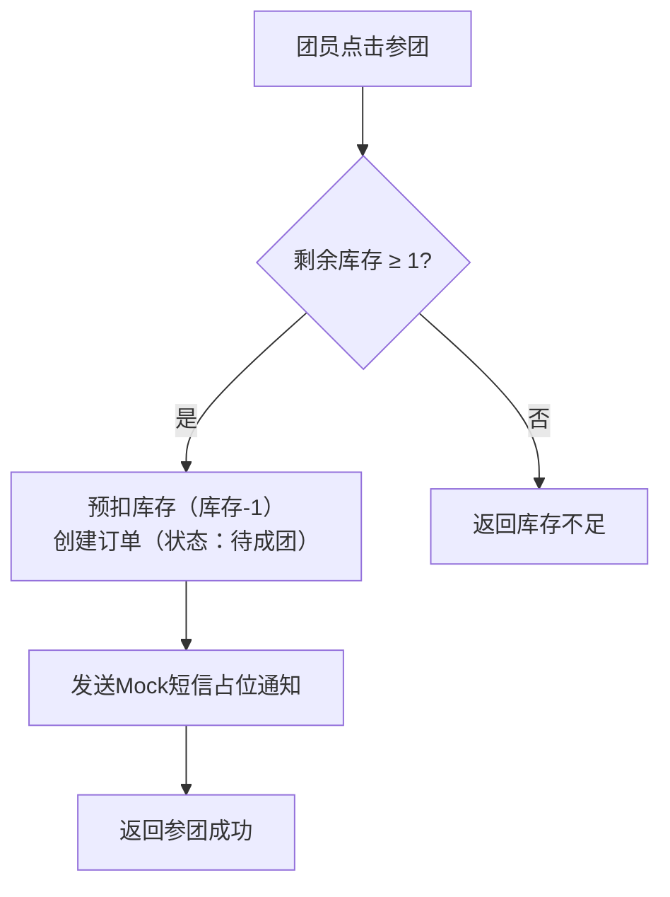

## 1. 产品概述

社区奶粉拼团平台，解决社区团长每周发起奶粉拼团时群接龙易超卖的问题。通过预扣库存、定时任务自动关单退款、团长实时进度监控，实现拼团流程的自动化与库存安全管控。

- 目标用户：社区团长（发起拼团、监控进度）、社区居民（参团购买奶粉）
- 核心价值：杜绝超卖、自动退款关单、团长实时掌握拼团进度

## 2. 核心功能

### 2.1 用户角色

| 角色 | 注册方式 | 核心权限 |
|------|----------|----------|
| 团长 | 手机号注册 | 创建/管理拼团、查看进度、查看团单列表 |
| 团员 | 手机号注册 | 浏览拼团列表、参团、查看我的订单 |

### 2.2 功能模块

1. **拼团大厅**：展示进行中的拼团列表、倒计时、当前人数/目标人数
2. **开团页**：团长填写商品信息、目标人数、截止时间、单价
3. **参团页**：团员查看拼团详情、一键参团（预扣库存）
4. **团长后台**：进度条展示、参团名单、团单状态管理
5. **我的订单**：团员查看订单状态（待成团/已成团/已退款）

### 2.3 页面详情

| 页面名称 | 模块名称 | 功能描述 |
|----------|----------|----------|
| 拼团大厅 | 拼团卡片列表 | 展示进行中的拼团，含商品图、价格、进度、倒计时 |
| 拼团大厅 | 筛选栏 | 按状态筛选（进行中/已成团/未成团） |
| 开团页 | 表单 | 填写商品名称、描述、图片、单价、目标人数、截止时间 |
| 开团页 | 库存设置 | 设置可用库存数量 |
| 参团页 | 拼团详情 | 展示商品信息、当前参团人数、进度条、倒计时 |
| 参团页 | 参团按钮 | 一键参团，预扣库存，发送短信占位通知 |
| 团长后台 | 进度总览 | 进度条展示各拼团完成率，状态标签 |
| 团长后台 | 参团名单 | 查看各拼团参团人员列表、手机号脱敏 |
| 团长后台 | 操作区 | 手动截止拼团、导出名单 |
| 我的订单 | 订单列表 | 展示个人参团订单及状态 |
| 我的订单 | 订单详情 | 展示订单金额、状态、退款信息 |

## 3. 核心流程

**拼团全流程：** 团长开团 → 团员参团（预扣库存+短信占位）→ 截止时刻到达 → 判断是否成团 → 成团：批量扣款 → 扣款失败：依次释放库存 → 未成团：定时任务批量退款并关单

**库存预扣流程：**

## 4. 用户界面设计

### 4.1 设计风格

- 主色调：暖橙 #FF6B35（社区温暖感）+ 深青 #1A535C（信任感）
- 辅助色：浅米 #F7F0E8（背景）、珊瑚 #FF8C61（渐变）、薄荷 #4ECDC4（成功状态）
- 按钮风格：圆角 12px，主按钮带轻微阴影与渐变
- 字体：标题使用粗体大字号，正文 14px，辅助信息 12px
- 布局：卡片式布局，顶部导航栏，响应式网格

### 4.2 页面设计概览

| 页面名称 | 模块名称 | UI元素 |
|----------|----------|--------|
| 拼团大厅 | 拼团卡片 | 圆角卡片、商品图、渐变进度条、倒计时标签、价格标签 |
| 拼团大厅 | 筛选栏 | 胶囊式标签切换 |
| 开团页 | 表单 | 分组卡片式表单、日期时间选择器、数字输入 |
| 参团页 | 拼团详情 | 大图展示、环形进度、参团头像列表、CTA按钮 |
| 团长后台 | 进度总览 | 水平进度条（渐变色）、状态徽章、统计卡片 |
| 团长后台 | 参团名单 | 表格+脱敏手机号、操作按钮 |
| 我的订单 | 订单列表 | 状态色彩标签、时间线式布局 |

### 4.3 响应式设计

- 桌面优先设计，最大宽度 1280px 居中
- 平板：双列卡片布局
- 移动端：单列卡片，底部固定参团按钮
- 触控优化：按钮最小 44px 点击区域

### 4.4 3D 场景

不适用
