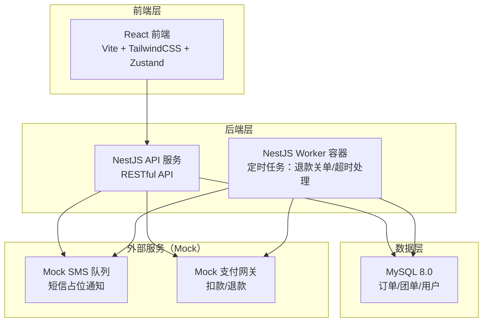
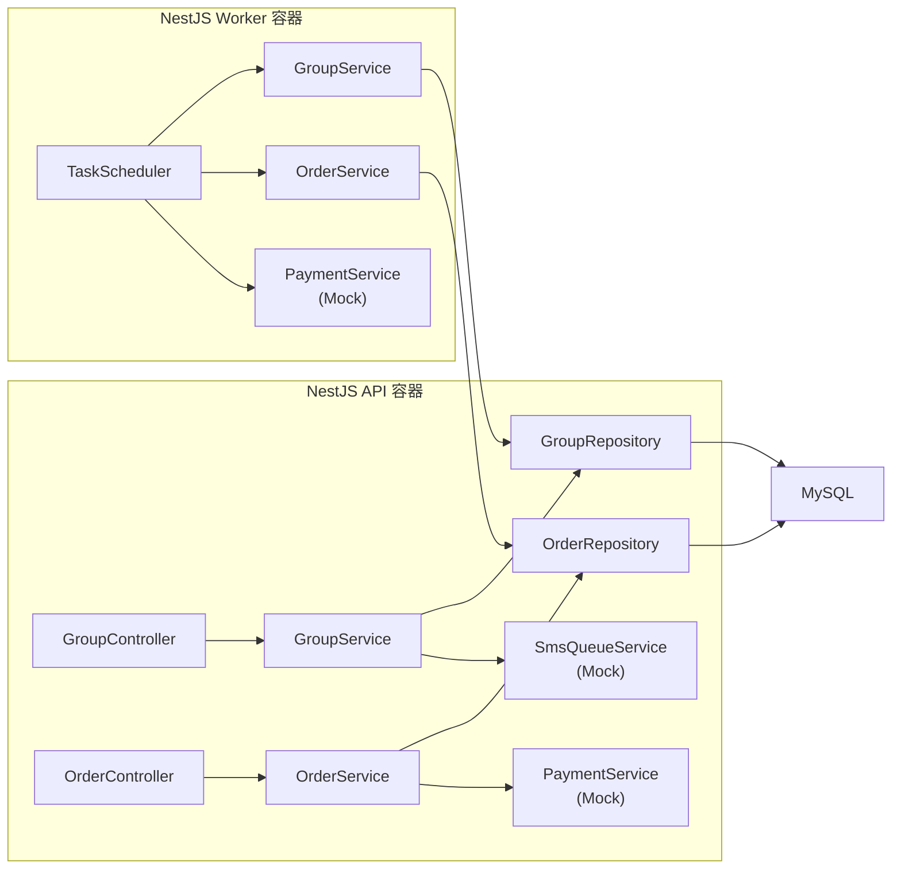
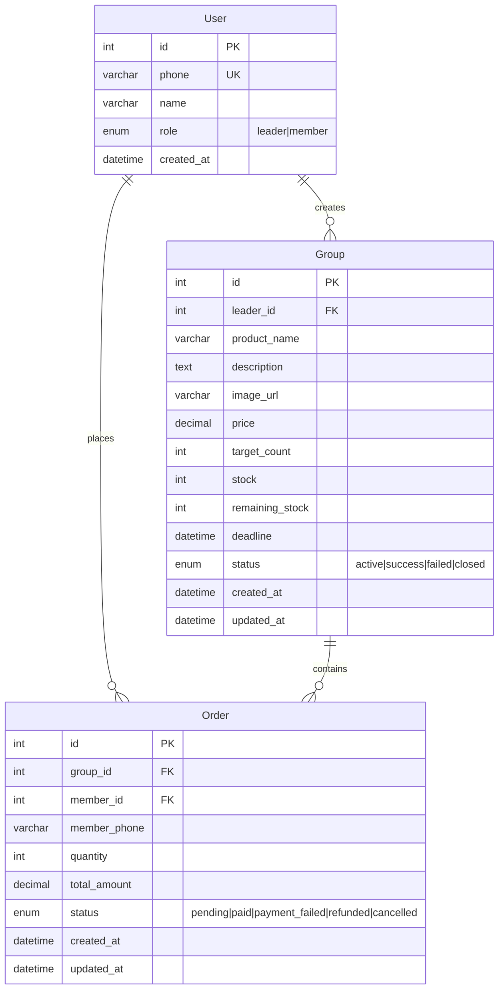

## 1. 架构设计



## 2. 技术说明

- 前端：React@18 + TailwindCSS@3 + Vite + Zustand
- 初始化工具：vite-init
- 后端：NestJS + TypeScript
- 数据库：MySQL 8.0
- 定时任务：NestJS @nestjs/schedule（独立 Worker 容器运行）
- 短信队列：内存 Mock 队列（BullMQ 风格接口，内存实现）
- 容器编排：docker-compose（api、worker、mysql 三个容器）

## 3. 路由定义

| 路由 | 用途 |
|------|------|
| `/` | 拼团大厅首页 |
| `/group/:id` | 拼团详情/参团页 |
| `/create` | 团长开团页 |
| `/dashboard` | 团长后台进度总览 |
| `/orders` | 我的订单页 |

## 4. API 定义

### 4.1 团长接口

| 方法 | 路径 | 描述 | 请求体 | 响应 |
|------|------|------|--------|------|
| POST | `/api/groups` | 创建拼团 | `{productName, description, imageUrl, price, targetCount, stock, deadline}` | `{id, ...group}` |
| GET | `/api/groups/managed` | 团长管理的拼团列表 | - | `Group[]` |
| PATCH | `/api/groups/:id/close` | 手动截止拼团 | - | `{success}` |
| GET | `/api/groups/:id/progress` | 获取拼团进度 | - | `{currentCount, targetCount, orders[]}` |

### 4.2 团员接口

| 方法 | 路径 | 描述 | 请求体 | 响应 |
|------|------|------|--------|------|
| GET | `/api/groups` | 拼团大厅列表 | `?status=active` | `Group[]` |
| GET | `/api/groups/:id` | 拼团详情 | - | `{group, currentCount, remainingStock, orders[]}` |
| POST | `/api/groups/:id/join` | 参团（预扣库存） | `{phone, quantity}` | `{orderId, status:"pending"}` |
| GET | `/api/orders` | 我的订单列表 | `?phone=xxx` | `Order[]` |
| GET | `/api/orders/:id` | 订单详情 | - | `{order, group}` |

### 4.3 定时任务接口（Worker 内部）

| 任务 | 调度 | 描述 |
|------|------|------|
| `checkExpiredGroups` | 每分钟 | 检查已过截止时刻的拼团，未成团则批量退款关单 |
| `processPaymentFailures` | 每分钟 | 处理扣款失败的订单，依次释放库存 |

### 4.4 TypeScript 类型定义

```typescript
interface Group {
  id: number;
  leaderId: number;
  productName: string;
  description: string;
  imageUrl: string;
  price: number;
  targetCount: number;
  stock: number;
  remainingStock: number;
  deadline: Date;
  status: "active" | "success" | "failed" | "closed";
  createdAt: Date;
  updatedAt: Date;
}

interface Order {
  id: number;
  groupId: number;
  memberPhone: string;
  quantity: number;
  totalAmount: number;
  status: "pending" | "paid" | "payment_failed" | "refunded" | "cancelled";
  createdAt: Date;
  updatedAt: Date;
}

interface User {
  id: number;
  phone: string;
  name: string;
  role: "leader" | "member";
  createdAt: Date;
}
```

## 5. 服务端架构图



## 6. 数据模型

### 6.1 数据模型定义（ER 图）



### 6.2 数据定义语言（DDL）

```sql
CREATE DATABASE IF NOT EXISTS group_buy DEFAULT CHARSET utf8mb4 COLLATE utf8mb4_unicode_ci;
USE group_buy;

CREATE TABLE `user` (
  `id` INT AUTO_INCREMENT PRIMARY KEY,
  `phone` VARCHAR(20) NOT NULL UNIQUE,
  `name` VARCHAR(50) NOT NULL,
  `role` ENUM('leader', 'member') NOT NULL DEFAULT 'member',
  `created_at` DATETIME NOT NULL DEFAULT CURRENT_TIMESTAMP
) ENGINE=InnoDB;

CREATE TABLE `group` (
  `id` INT AUTO_INCREMENT PRIMARY KEY,
  `leader_id` INT NOT NULL,
  `product_name` VARCHAR(100) NOT NULL,
  `description` TEXT,
  `image_url` VARCHAR(500),
  `price` DECIMAL(10,2) NOT NULL,
  `target_count` INT NOT NULL,
  `stock` INT NOT NULL,
  `remaining_stock` INT NOT NULL,
  `deadline` DATETIME NOT NULL,
  `status` ENUM('active', 'success', 'failed', 'closed') NOT NULL DEFAULT 'active',
  `created_at` DATETIME NOT NULL DEFAULT CURRENT_TIMESTAMP,
  `updated_at` DATETIME NOT NULL DEFAULT CURRENT_TIMESTAMP ON UPDATE CURRENT_TIMESTAMP,
  INDEX `idx_leader_id` (`leader_id`),
  INDEX `idx_status_deadline` (`status`, `deadline`)
) ENGINE=InnoDB;

CREATE TABLE `order` (
  `id` INT AUTO_INCREMENT PRIMARY KEY,
  `group_id` INT NOT NULL,
  `member_id` INT NOT NULL,
  `member_phone` VARCHAR(20) NOT NULL,
  `quantity` INT NOT NULL DEFAULT 1,
  `total_amount` DECIMAL(10,2) NOT NULL,
  `status` ENUM('pending', 'paid', 'payment_failed', 'refunded', 'cancelled') NOT NULL DEFAULT 'pending',
  `created_at` DATETIME NOT NULL DEFAULT CURRENT_TIMESTAMP,
  `updated_at` DATETIME NOT NULL DEFAULT CURRENT_TIMESTAMP ON UPDATE CURRENT_TIMESTAMP,
  INDEX `idx_group_id` (`group_id`),
  INDEX `idx_member_id` (`member_id`),
  INDEX `idx_status` (`status`)
) ENGINE=InnoDB;

ALTER TABLE `group` ADD CONSTRAINT `fk_group_leader` FOREIGN KEY (`leader_id`) REFERENCES `user`(`id`);
ALTER TABLE `order` ADD CONSTRAINT `fk_order_group` FOREIGN KEY (`group_id`) REFERENCES `group`(`id`);
ALTER TABLE `order` ADD CONSTRAINT `fk_order_member` FOREIGN KEY (`member_id`) REFERENCES `user`(`id`);

INSERT INTO `user` (`phone`, `name`, `role`) VALUES
  ('13800001111', '张团长', 'leader'),
  ('13800002222', '李团员', 'member'),
  ('13800003333', '王团员', 'member'),
  ('13800004444', '赵团员', 'member'),
  ('13800005555', '刘团员', 'member');

INSERT INTO `group` (`leader_id`, `product_name`, `description`, `image_url`, `price`, `target_count`, `stock`, `remaining_stock`, `deadline`, `status`) VALUES
  (1, '飞鹤星飞帆3段奶粉', '社区拼团价，正品保障，限时抢购', '', 198.00, 10, 15, 12, DATE_ADD(NOW(), INTERVAL 2 DAY), 'active'),
  (1, '惠氏启赋3段奶粉', '进口品质，拼团更优惠', '', 268.00, 8, 10, 10, DATE_ADD(NOW(), INTERVAL 1 DAY), 'active');

INSERT INTO `order` (`group_id`, `member_id`, `member_phone`, `quantity`, `total_amount`, `status`) VALUES
  (1, 2, '13800002222', 1, 198.00, 'pending'),
  (1, 3, '13800003333', 1, 198.00, 'pending'),
  (1, 4, '13800004444', 1, 198.00, 'pending');
```

## 7. Docker-Compose 配置

```yaml
version: "3.8"

services:
  mysql:
    image: mysql:8.0
    environment:
      MYSQL_ROOT_PASSWORD: root123
      MYSQL_DATABASE: group_buy
      MYSQL_USER: app
      MYSQL_PASSWORD: app123
    ports:
      - "3306:3306"
    volumes:
      - mysql_data:/var/lib/mysql
      - ./migrations:/docker-entrypoint-initdb.d
    healthcheck:
      test: ["CMD", "mysqladmin", "ping", "-h", "localhost"]
      interval: 5s
      timeout: 3s
      retries: 10

  api:
    build:
      context: .
      dockerfile: Dockerfile
      target: api
    ports:
      - "3000:3000"
    environment:
      DB_HOST: mysql
      DB_PORT: 3306
      DB_USERNAME: app
      DB_PASSWORD: app123
      DB_DATABASE: group_buy
      NODE_ENV: production
    depends_on:
      mysql:
        condition: service_healthy

  worker:
    build:
      context: .
      dockerfile: Dockerfile
      target: worker
    environment:
      DB_HOST: mysql
      DB_PORT: 3306
      DB_USERNAME: app
      DB_PASSWORD: app123
      DB_DATABASE: group_buy
      NODE_ENV: production
      WORKER_MODE: "true"
    depends_on:
      mysql:
        condition: service_healthy

volumes:
  mysql_data:
```

## 8. 接口文档

### 8.1 创建拼团

- **URL**: `POST /api/groups`
- **请求头**: `Content-Type: application/json`
- **请求体**:
```json
{
  "productName": "飞鹤星飞帆3段奶粉",
  "description": "社区拼团价，正品保障",
  "imageUrl": "",
  "price": 198.00,
  "targetCount": 10,
  "stock": 15,
  "deadline": "2026-06-10T18:00:00.000Z"
}
```
- **成功响应** `201`:
```json
{
  "id": 1,
  "leaderId": 1,
  "productName": "飞鹤星飞帆3段奶粉",
  "price": 198.00,
  "targetCount": 10,
  "stock": 15,
  "remainingStock": 15,
  "deadline": "2026-06-10T18:00:00.000Z",
  "status": "active",
  "createdAt": "2026-06-05T10:00:00.000Z"
}
```
- **失败响应** `400`: `{ "message": "参数校验失败", "errors": [...] }`

### 8.2 获取拼团列表

- **URL**: `GET /api/groups?status=active`
- **成功响应** `200`:
```json
[
  {
    "id": 1,
    "productName": "飞鹤星飞帆3段奶粉",
    "price": 198.00,
    "targetCount": 10,
    "currentCount": 3,
    "remainingStock": 12,
    "deadline": "2026-06-10T18:00:00.000Z",
    "status": "active",
    "imageUrl": ""
  }
]
```

### 8.3 获取拼团详情

- **URL**: `GET /api/groups/:id`
- **成功响应** `200`:
```json
{
  "id": 1,
  "leaderId": 1,
  "leaderName": "张团长",
  "productName": "飞鹤星飞帆3段奶粉",
  "description": "社区拼团价，正品保障",
  "imageUrl": "",
  "price": 198.00,
  "targetCount": 10,
  "currentCount": 3,
  "stock": 15,
  "remainingStock": 12,
  "deadline": "2026-06-10T18:00:00.000Z",
  "status": "active",
  "orders": [
    { "id": 1, "memberPhone": "138****2222", "quantity": 1, "status": "pending", "createdAt": "..." }
  ]
}
```

### 8.4 参团

- **URL**: `POST /api/groups/:id/join`
- **请求体**:
```json
{
  "phone": "13800006666",
  "quantity": 1
}
```
- **成功响应** `201`:
```json
{
  "orderId": 4,
  "status": "pending",
  "message": "参团成功，已预扣库存"
}
```
- **失败响应** `409`: `{ "message": "库存不足" }`
- **失败响应** `400`: `{ "message": "拼团已截止" }`

### 8.5 获取拼团进度

- **URL**: `GET /api/groups/:id/progress`
- **成功响应** `200`:
```json
{
  "groupId": 1,
  "currentCount": 3,
  "targetCount": 10,
  "progressPercent": 30,
  "remainingStock": 12,
  "status": "active",
  "orders": [
    { "id": 1, "memberPhone": "138****2222", "quantity": 1, "status": "pending" },
    { "id": 2, "memberPhone": "138****3333", "quantity": 1, "status": "pending" },
    { "id": 3, "memberPhone": "138****4444", "quantity": 1, "status": "pending" }
  ]
}
```

### 8.6 手动截止拼团

- **URL**: `PATCH /api/groups/:id/close`
- **成功响应** `200`:
```json
{
  "success": true,
  "finalStatus": "success",
  "message": "拼团已截止，成团成功"
}
```

### 8.7 获取我的订单

- **URL**: `GET /api/orders?phone=13800002222`
- **成功响应** `200`:
```json
[
  {
    "id": 1,
    "groupId": 1,
    "productName": "飞鹤星飞帆3段奶粉",
    "quantity": 1,
    "totalAmount": 198.00,
    "status": "pending",
    "createdAt": "2026-06-05T10:30:00.000Z"
  }
]
```

### 8.8 获取订单详情

- **URL**: `GET /api/orders/:id`
- **成功响应** `200`:
```json
{
  "id": 1,
  "groupId": 1,
  "group": {
    "productName": "飞鹤星飞帆3段奶粉",
    "status": "active",
    "deadline": "2026-06-10T18:00:00.000Z"
  },
  "memberPhone": "138****2222",
  "quantity": 1,
  "totalAmount": 198.00,
  "status": "pending",
  "createdAt": "2026-06-05T10:30:00.000Z",
  "updatedAt": "2026-06-05T10:30:00.000Z"
}
```
